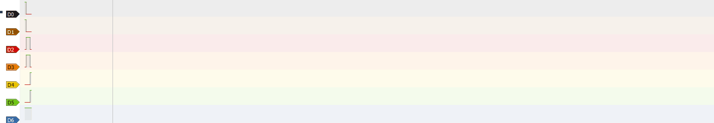
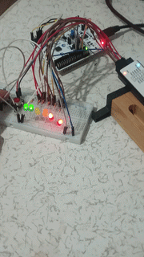

# LED Management

### Simulation/Testing

- Logic Analyzer results

- Real footage

## Features

    • Bare-Metal Programming
    • External Interrupts
    • Timer Delay
    • GPIO Configuration
    • Logic Analyzer Verification

## Pin Configuration

| Pin | Function | MODE |
|-----|----------|------|
| PA1 | LED1 | INPUT |
| PA2 | LED2 | INPUT |
| PA3 | LED3 | INPUT |
| PA4 | LED4 | INPUT |
| PA5 | LED5 | INPUT |
| PA6 | Button 1 (EXTI) | OUTPUT |
| PA7 | Button 2 (EXTI) | OUTPUT |

## Purpose

In this project, I worked on changing the states of six LEDs using two buttons with only Bare-Metal programming. My goal in this project was to review, reinforce, and permanently learn the GPIO, RCC, INTERRUPT, and TIMER topics by putting them into practice. I also wanted to learn both the behavior of the pins and how to use a Logic Analyzer. This is the first project in which I physically programmed and ran an STM32.

### Registers Used

- RCC
- GPIOA
- EXTI
- SYSCFG
- NVIC
- TIM3

## Learning Outcomes

- ✅ Learned **pin-register-digital behavior** using a Logic Analyzer and how to analyze signals with PulseView.
- ✅ Learned how to **adjust the microcontroller frequency** using **TIMER** and write a custom `delay()` function.
- ✅ Reinforced and gained a clearer understanding of **INTERRUPT** structures using two different buttons.
- ✅ Learned how to use STM32CubeIDE and STM32CubeMX.
- ✅ Learned how to configure and connect the pins on the board.

## Technical Details

### Registers Describe

All switches and LEDs were connected to Port A, and Port A was enabled using GPIO. PA1, PA2, PA3, PA4, and PA5 were used for the LEDs, while PA6 and PA7 were used for the switches. Whenever a button is pressed, the `leds_status` variable is changed using `if` blocks to modify the LED blinking speed and sequence. The required input/output assignments were configured with `MODER`, pull-up resistors were assigned to the buttons with `PUPDR`, interrupts were assigned to PA6 and PA7 with `EXTICR`, the falling edge trigger was configured with `FTSR1`, interrupt masking was enabled with `IMR`, and the function written inside the board for protection purposes was enabled using `NVIC_EnableIRQ()`. In the TIMER section, I wrote my own `delay()` function. The counter is reset with `CNT`, the board frequency is reduced with `PSC`, the target time is defined with `ARR`, `SR` is cleared first, and the clock is started with `CR1`. After the `while` loop waits until the target time is reached, `SR` is enabled by the board internally, and then `SR` is cleared again for the next use. Inside `EXTI4_15_IRQHandler(void)`, the trigger status of the switches is checked using `FPR1`, and the necessary assignments are made to the `leds_status` variable. Inside `main()`, the LED blinking speeds and sequences are defined. The changes performed by interrupts are handled using `if` blocks. (Each code block is explained with comments placed next to it.)

### Components List

- 2 LEDs of each color (red, yellow, green)
- 2 Tactile Switches
- Jumper Wires
- Logic Analyzer (24 MHz, 8 Channels)
- 6 × 330 Ω Resistors

## Future Improvements

- The current TIMER implementation blocks the system and reduces efficiency. Interrupt-based timers should be used instead.
- The onboard button is currently used to return to the initial state. A separate button should be added.
- The LEDs do not respond immediately when a button is pressed because the current sequence must finish first. The structure can be redesigned to allow an immediate response.