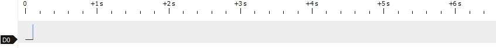
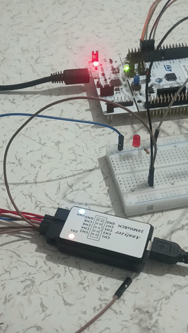

# TIMER-INTERRUPT Practice

### Simulation/Testing

- Logic Analyzer results

- Real footage

## Features

    • Bare-Metal Implementation : STM32 kütüphaneleri kullanmadan, doğrudan register seviyesinde (CMSIS) firmware geliştirme.
    • Timer-Interrupt Architecture : Gecikme veya sistemi bekletme olmadan zamanlama kullanımı
    • GPIO Configuration : LED davranışlarının yapılandırılması
    • Logic Analyzer Verification : Sinyal zamanlamalarının ve donanımların davranışlarının izlenmesi

## Pin Configuration

| Pin | Function | MODE |
|-----|----------|------|
| PA1 | LED | OUTPUT |

## Purpose

Bu çalışma sadece Timer-Interrupt mimarisini anlamak-öğrenmek-pekiştirmek için yapılmıştır.

### Registers Used

- RCC
- GPIOA
- NVIC
- TIM3
- DMA

## Learning Outcomes

- ✅ Timer-Interrupt mimarisi kavranıldı.

## Technical Details

### Registers Describe

`RCC` ile `TIM3` ve A portu açıldı. `DMA` kullanılarak Timer-Interrupt aktif edildi. `PSC` ve `ARR` ile frekans düşürme ve zamanlama ayarları yapıldı. `SR` registerını kontrol ederek zaman dolduğunda kesme aktif ediliyor ve `led_status` değişkeni değiştiriliyor. Daha sonra `SR` registerı resetleniyor. `CRT` ile zamanlayıcı başlatılıyor. `while` döngüsü içinde sadece `if` bloğu ile `toggle` kullanılarak LED'in saniyede 1 yanıp sönmesi sağlanıyor.

### Components list
    
    -1 LED
    -1 330 OHM Resistor