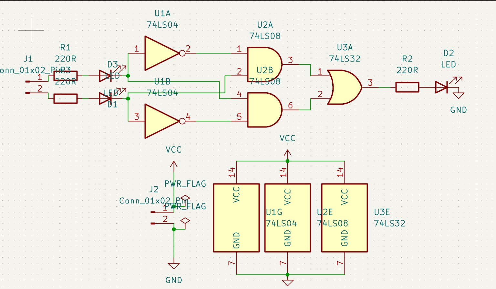
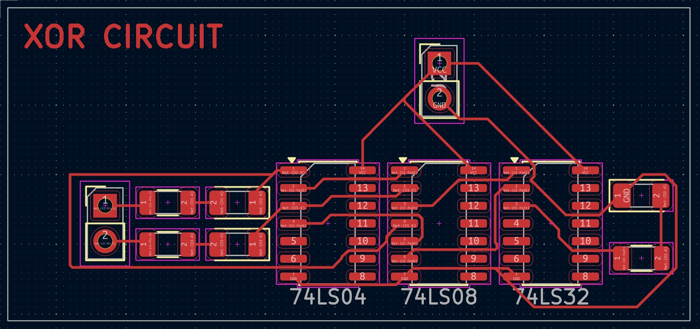

# DİGİTAL LOGİC XOR GATE CİRCUİT

## DESCRİPTİON 

I designed this circuit by replicating the internal structure of an XOR gate, aiming to both grasp digital system design and understand how logic gates operate. I used 2 NOT, 2 AND, and 1 OR gates. One of the incoming signals is inverted by the NOT gate while the other signal goes directly to one of the AND inputs. The AND gates activate only when both incoming signals are 1, and the digital data from these 2 AND gates are finally transferred to the 2 inputs of the OR gate. This way, we achieve the functionality of an XOR gate.

** Output = $(A \cdot \bar{B}) + (\bar{A} \cdot B)$ **

### Truth Table

| Input A | Input B | Output (LED) |
| :---: | :---: | :---: |
| 0 | 0 | 0 |
| 0 | 1 | 1 |
| 1 | 0 | 1 |
| 1 | 1 | 0 |

### Components

    1x 74LS04 (NOT)
    1x 74LS08 (AND)
    1x 74LS32 (OR)

### Wiews

