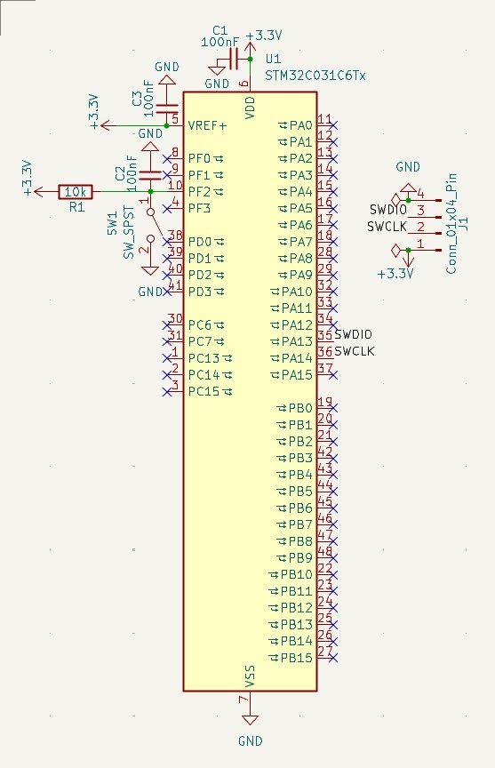
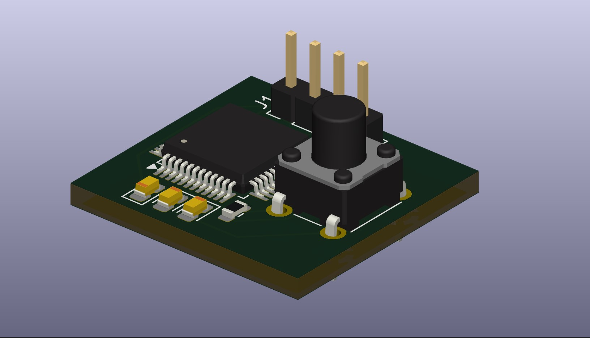

# STM32 MINIMAL VIABLE SYSTEM

## Purpose

I designed this project to learn the minimal viable system circuit required for the STM32 C031C6 chip to operate, to be able to design it, to **repeat my previous studies** within this circuit, and to learn pin configurations.

## Learning Outcomes

- ✅ **The logic of decoupling capacitors** and their **positioning** in microcontrollers, integrated circuits, and processors, along with the **importance of being placed close** to the pins
- ✅ The placement and importance of pull-up resistors in microcontrollers, integrated circuits, and processors
- ✅ Why a Minimal Viable System needs to be designed, and its implementation

## Technical Details

### Components list

    - 1x4 Pinheader Connector
    
    - 1 Resistor 10k Ohm (SMD)
    
    - 1 Tactile Switch
    
    - 3 Ceramic Capacitors 100nF (SMD)

### Schematic explanation

I placed the capacitors close to the pins for decoupling—meaning noise suppression—and through this topic, I also understood **why these capacitors must be so close to the pins**. The PF2 pin, marked with number 10, is the reset pin; therefore, a pull-up resistor becomes a necessity here because ambient noise could otherwise make this supply line unstable. The PA13 pin, marked with number 35, **which provides bidirectional transfer of debug and programming data**, and the PA14 pin, marked with number 36, **which provides the clock signal required for the synchronization of this communication**, are connected to the respective pins of the connector that is tied to the supply and ground lines. The VREF+ pin, marked with number 5, is the pin where we provide the **reference voltage** necessary **to read data from sensors**, and it is connected to the 3.3V pin of the connector.

### Images/graphs

- Schematic Design

- PCB Design

- 3D View

## Design Decisions

- 3 capacitors were added for noise suppression at the inputs (**decoupling**) purposes — their close proximity is crucial in the PCB design —,

- The resistor was included to prevent instability (Floating) at the pin and to keep the pin at Logic 1 (3.3V) level by default (Pull-up). It also prevents a short circuit when the button is pressed.

- The switch was included to pull the pin to zero (GND) and trigger a hardware reset for the processor.