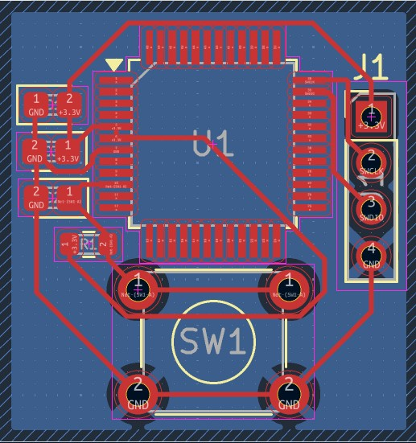

# STM32 MINIMAL VIABLE SYSTEM

## Purpose

Bu projeyi; STM32 C031C6 çipinin çalışması için mınımal vıable system devresini öğrenmek, tasarımını yapabilmek, bu devrede **önceki çalışmalarımı tekrar edebilmek**, pin yapılandırmalarını öğrenebilmek için tasarladım.

## Learning Outcomes

- ✅ **Decopling kapasitörleri mantığı** ve mikrodenetleyicilerde, entegrelerde ve işlemcilerde **konumlandırılması**, **yakın olmasının önemi**
- ✅ Pull-up dirençlerinin mikrodenetleyicilerde, entegrelerde ve işlemcilerde yerleştirilmesi ve önemi
- ✅ Neden Minimal Viable System tasarlanması gerektiği ve tasarımı

## Technical Details

### Circuit Design

- Components list

    -1x4 Pinheader Connector
    
    -1 Resistor 10k Ohm (SMD)
    
    -1 Tacticle Switch
    
    -3 Seramic Capacitors 100nF (SMD)

- Schematic explanation

Kondansatörleri decoupling yani gürültü engellemek için pin yakınlarına yerleştirdim, bu konu ile birlikte de bu kondansatörlerin **neden pinlere bu kadar yakın olması gerektiğini de** anlamış oldum. 10 numara ile işaretlenmiş PF2 pininin reset atma pini olduğu haliyle pull-up direnci burada zorunluluk haline geliyor çünkü havadaki gürültü burada ki beslemeyi kararsız hale getirebilir. **Debug ve programlama verilerinin çift yönlü aktarımını sağlayan** 35 ile numaralandırılmış PA13 ve **bu haberleşmenin senkronizasyonu için gereken saat sinyalini sağlayan** 36 ile numaralandırılmış PA14 pini besleme ve toprak hattına bağlanmış konnektörün ilgili pinlerine bağlanmıştır. 5 ile numaralandırılmış VREF+ pini ise; **sensörlerde veri okuması yapılabilmesi** için gerekli olan **referans voltajını** vereceğimiz pindir, konnektörün 3.3V bacağına bağlanmıştır.

### Images/graphs

- Schematic Design

- PCB Design

- 3D View

## Design Decisions

- 3 kapasitör, girişlerde gürültü engellemek için (**decopling**) amaçlı -pcb tasarımda yakın olması önemli-,

- Direnç, pindeki kararsızlığı (Floating) engellemek ve pini varsayılan olarak 1 (3.3V) seviyesinde tutmak için konuldu (Pull-up). Aynı zamanda butona basıldığında kısa devreyi engeller.

- Anahtar pini sıfıra (GND) çekip işlemciye donanımsal reset attırmak için konuldu.