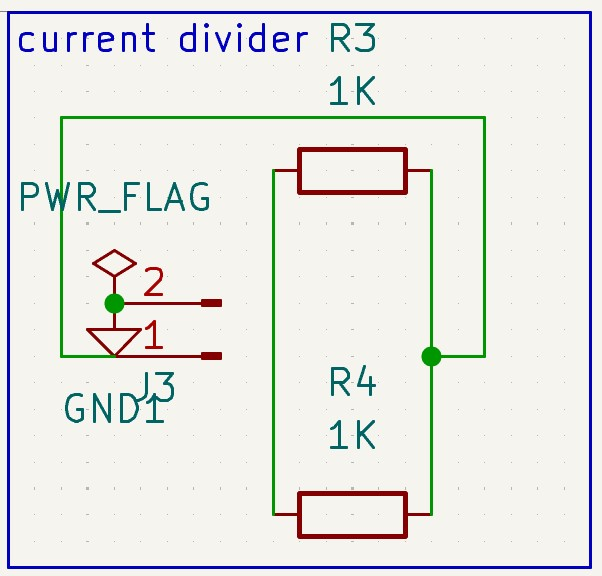
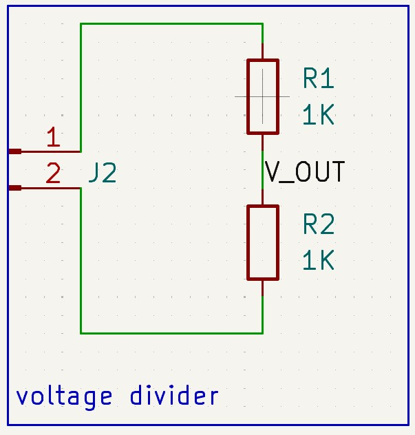
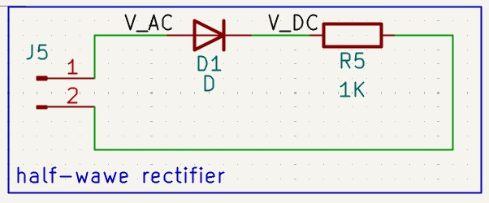

# Fundamental Circuits

My goal with these circuits was to learn the **functions and behaviors** of basic components. Below I’ve explained what I did in each circuit, what I learned, and which behaviors I understood. To grasp the characteristics of each circuit – **especially for capacitors and inductors** – I also used KiCad’s simulation engine (powered by LTspice). 

## Current Divider

I designed this circuit to observe the behavior of current in **parallel-connected resistors**.

### Components

    2 Resistors
    1 1x2 Connector

## Voltage Divider

I designed this circuit to observe the behavior of voltage across **series-connected resistors**.

### Components

    2 Resistors
    1 1x2 Connector

## Half-Wave Rectifier

I designed this circuit to understand how we can pass **only the positive or only the negative half** of a sinusoidal signal.

### Components

    1 Diods
    1 Resistor
    1 1x2 Connector

## Full-Wave Rectifier

I designed and simulated this circuit to understand how to rectify **both the positive and negative halves** of a sinusoidal signal. This circuit especially helped me grasp the **relationship between current and diodes**. **A capacitor connected in parallel with the load resistor will smooth out the ripples.**

### Components

    4 Diods
    1 Resistor
    1 1x2 Connector

## RC Circuit

I designed and simulated this circuit to understand the behavior of a capacitor connected in series with a DC source: it initially acts like a short circuit while charging, and eventually behaves like an open circuit. Once the capacitor charges logarithmically (in **voltage**), it acts like an open circuit and no longer passes current.

### Components

    1 Capacitor
    1 Resistor
    1 1x2 Connector

## RL Circuit

I designed and simulated this circuit to understand the behavior of an inductor connected in series with a DC source: it initially acts like an open circuit, then charges and eventually behaves like a short circuit. Once the inductor charges logarithmically (in **current**), it acts like a short circuit and passes an infinite current (ideally).

### Components

    1 Inductor
    1 Resistor
    1 1x2 Connector

## PCB Designs

