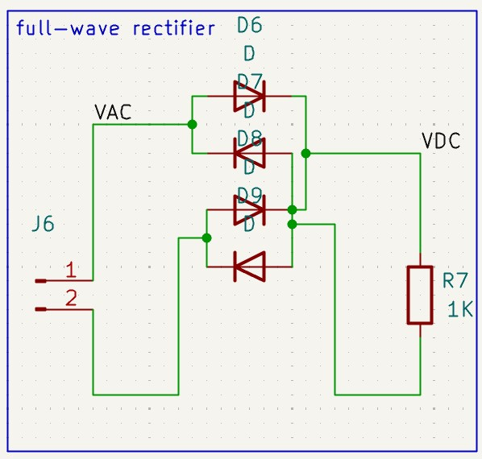
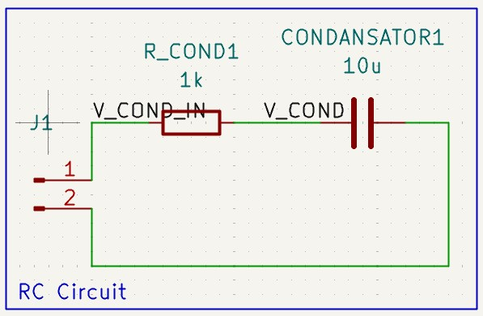
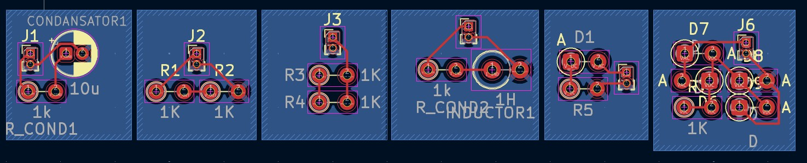
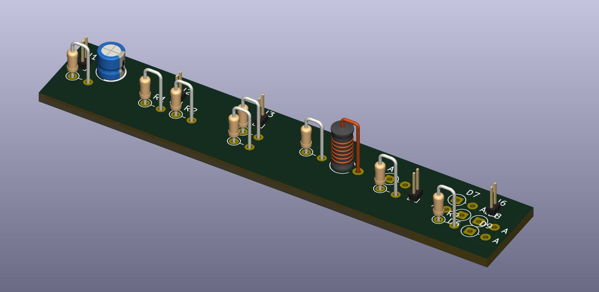

# Fundamental Circuits

Bu devrelerde amacım temel devreleri ve komponentlerin; **işlevlerini ve devranışlarını** öğrenebilmek idi. Aşağıya her bir devrede ne yaptığımı, ne öğrendiğimi ve nelerin davranışını anladığımı yazdım. Her bir devrenin karakteristiğini anlayabilmek için -**özellikle kapasitör ve bobinde**- Kicad'in LTSpice motorlu simülasyon programını da kullandım. 

## Current Divider

Bu devreyi akımın **paralel bağlı dirençlerde** davranışını görebilmek için tasarladım.

### Components

    2 Resistors
    1 1x2 Connector

## Voltage Divider

Bu devreyi gerilimin **seri bağlı dirençlerde** davranışını görebilmek için tasarladım.

### Components

    2 Resistors
    1 1x2 Connector

## Half-Wave Rectifier

Bu devreyi, sinüs sinyalinin **sadece pozitif veya negatif kısımlarını** nasıl geçireceğimizi anlamak için tasarladım.

### Components

    1 Diods
    1 Resistor
    1 1x2 Connector

## Full-Wave Rectifier

Bu devreyi, sinüs sinyalinin **pozitif-negatif kısımlarını** nasıl doğrultacağımızı anlamak için tasarladım ve simüle ettim. Bu devre özellikle **akımın diyotlar ile olan ilişkisini** kavramamda çok yardımı oldu. **Yük direncine paralel bağlanan bir kapasitör dalgalanmaları sönümleyecektir**

### Components

    4 Diods
    1 Resistor
    1 1x2 Connector

## RC Circuit

Bu devreyi, DC kaynağa seri bağlanan bir kapasitörün başta kısa devre gibi şarj ve sonda açık devre gibi davranma davranışlarını anlamak için tasarladım ve simüle ettim. Kapasitör logaritmik olarak şarj olduktan **(gerilim)** sonra açık devre gibi davranır ve akım geçirmez.

### Components

    1 Capacitor
    1 Resistor
    1 1x2 Connector

## RL Circuit

Bu devreyi, DC kaynağa seri bağlanan bir indüktörün başta açık devre gibi, şarj ve en son açık devre gibi davranma davranışlarını anlamak için tasarladım ve simüle ettim. İndüktör logaritmik olarak şarj olduktan **(akım)** sonra kısa devre gibi davranır ve  sonusz akım geçirir.

### Components

    1 Inductor
    1 Resistor
    1 1x2 Connector

## PCB DESİGNS

## 3D View

