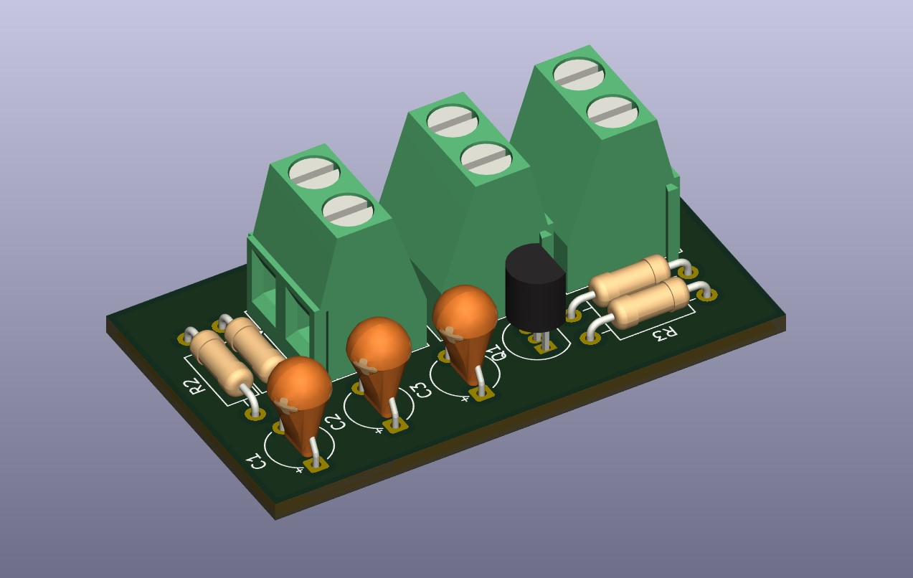

# HIERARCHICAL AMPLIFIER

I designed this circuit to understand the logic behind BJT transistor design, comprehend how fundamental circuits like audio amplifiers are structured, and **learn the basics of hierarchical design**.

## Components

    1 BC547
    4 Resistors
    3 Capacitors (10 microfarads each)
    3 Screw Terminals

## Uses and Purposes of Components

I used the R1 and R2 resistors to provide a **stable voltage value** to the Base pin of the transistor (voltage-divider). The C2 and C3 capacitors placed at the AUDIO_IN and AUDIO_OUT pins function as **coupling capacitors**; they protect or isolate the alternating current (AC) from the direct current (DC), preventing signal distortions. The R4 resistor on the Emitter pin is used to prevent the heating transistor from drawing excessive current, and the parallel-connected C1 capacitor acts as a **Bypass capacitor**, allowing the signal to flow smoothly through the capacitor, thereby maximizing the **AC Voltage Gain** of the circuit.

### PCB Design

### 3D View

