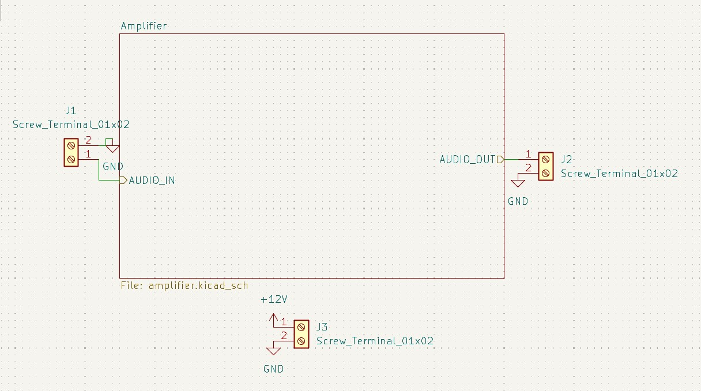
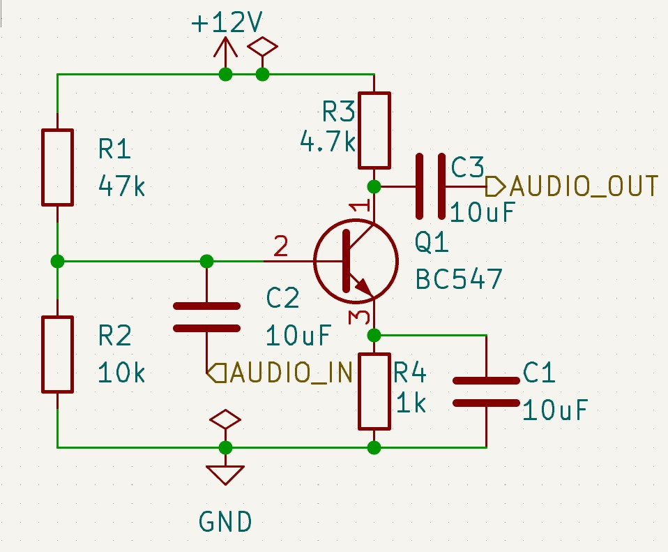
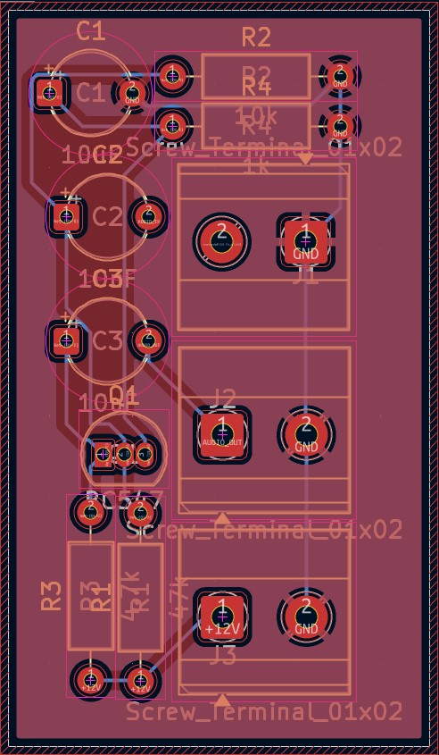

# HİERARCHİCAL AMPLİFİER

Bu devreyi, bjt transistör tasarımı ile mantığını anlamak, ses yükselteçler gibi devrelerin temel olarak nasıl tasarlandığını anlamak ve hiyerarşik tasarımın temellerini öğrenmek için tasarladım. 

## Components

    1 BC 547
    4 RESISTORS
    3  10 MICROFARADS EACH CAPACITORS
    3 SCREW TERMINALS

## Uses and Purposes of Components

R1 ve R2 direncini, transistörün Base bacağına **sabit bir voltaj değeri** vermek için kullandım (voltage-divider). AUDIO_IN ve AUDIO_OUT bacağına yerleştirilen C2 ve C3 kondansatörü **kuplaj kondansatörü** işlevi görüyor, alternatif akımı doğru akımdan koruyarak veya ayırarak, bozulmaların önüne geçiyor. Emitter bacağındaki R4 direnci ısınan transistörün fazla akım çekmemesi için kullanılıyor, paralel bağlanan C1 kondansatörü **By-Pass kondasatörü** işlevi görüyor, sinyalin rahatça kondasatör üzerinden akmasını sağlar böylece devrenin **AC Voltage Gain** maksimuma çıkar.

### PCB Design

