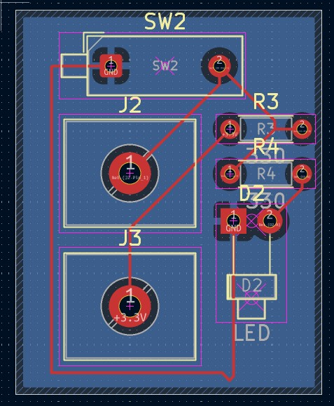

# PULL-UP CIRCUIT

## Purpose

I designed this circuit to understand the logic of pull-up resistors and why we use them.

## Learning Outcomes

- ✅ Pull-up design rules were learned
- ✅ It was understood that pull-up resistors must be used in designs to prevent **floating** at microcontroller pin inputs or similar scenarios.

## Technical Details

### Circuit Design

- Components list

    **2x 1x1 Connectors (J2, J3)**
    
    **2x 330Ω Resistors (R3, R4)**

    **1x LED Diode**

    **1x Push Button (SW2)**

- Design calculations

Taking the VCC voltage as a 5V reference.

**R4 value selected for the safe operation of the LED:** $$I_{LED} = \frac{V_{CC} - V_f}{R_4} = \frac{5\text{V} - 2\text{V}}{330\,\Omega} \approx 9.09\text{ mA}$$

**Power dissipation value on the R3 resistor:**

$$P = \frac{V_{CC}^2}{R_3} = \frac{5^2}{330} \approx 75\text{ mW}$$

- Schematic explanation

    In the circuit, if we consider the J3 connector as the test point where the digital input signal is applied and the J2 connector as the microcontroller pin, the digital value from J3 is directly tied to J2. This ensures a constant digital '1' state, eliminates noise, and prevents the **pin from floating**. When the SW2 switch is activated, it connects the line directly to ground, pulling the digital value down to '0'. In this way, **floating** is completely prevented.

### Simulation/Testing

- Test results

    Case 1: BUTTON RELEASED -> Logic value 1, J2 connector senses VCC.
    
    Case 2: BUTTON PRESSED -> Logic value 0, J2 connector is connected to ground.

- Images

## Design Decisions

Resistors R3 and R4 were placed to prevent short circuits and limit current, the push button was utilized to simulate the pull-up mechanism, and the LED was included for visual status control.

## Future Improvements

- Adding a capacitor ($C$) in parallel with the button to prevent mechanical contact bounce (signal sparking) at the hardware level.

- Adding an NPN transistor driver to eliminate the voltage drop caused by the LED load. This ensures that the J2 pin stays at a full 5V instead of dropping to ~3.3V when the LED draws current.