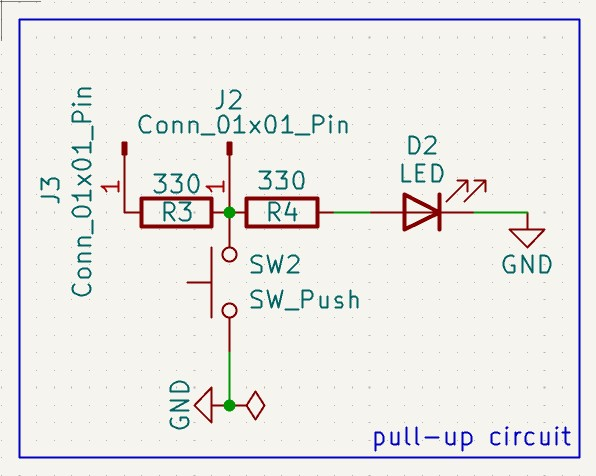

# PULL-UP CIRCUIT

## Purpose

Bu devreyi pull-up direnç mantığını ve neden kullandığımızı anlamak için tasarladım. 

## Learning Outcomes

- ✅ Pull-up tasarım kuralları öğrenildi
- ✅ Pull-up dirençlerin mikrodenetleyici pin girişlerinde veya benzeri durumlarda **floating** önlenmesi için taarımlarda kullanılması gerekildiği kavranıldı.

## Technical Details

### Circuit Design

- Components list

    **2 1x1 Connector**
    
    **2 330R Each Resistors**

    **1 LED Diod**

    **Push Button**

- Design calculations

VCC gerilimini 5V referans alınıyor.

**LED'in güvenli yanması için seçilen R4 değeri:**  $$I_{LED} = \frac{V_{CC} - V_f}{R_4} = \frac{5\text{V} - 2\text{V}}{330\,\Omega} \approx 9.09\text{ mA}$$

**R3 direnci üzerinde tüketilen güç değeri:**

$$P = \frac{V_{CC}^2}{R_3} = \frac{5^2}{330} \approx (75\text{ mW})$$

- Schematic explanation

    Devrede J3 konnektörünü dijital değerin geldiği pin, J2 konnektörünü ise bir mikrodenetleyici olarak düşünürsek, J3 den gelen dijital değer direk J2 konnektörüne bağlanarak sürekli dijital 1 değeri gelmesi sağlanıyor, gürültü olmuyor, **pin yüzmüyor (floating)**. SW2 anahtarı doğrudan toprağa bağlanarak  anahtar etkinleştirildiğinde devre dijital değer 0 oluyor. Bu sayede **floating** önleniyor. 

### Simulation/Testing

- Test results

    1.Durum: BUTON SERBEST -> Lojik değer 1, J2 konnektörü VCC görür.
    
    2.Durum: BUTON BASILI -> Lojikd değer 0, J2 konnektörü toprağa bağlanır. 

- Images

## Design Decisions

R3 ve R2 dirençleri kısa devre önlemek için , push button pull-up simüle etmek için, LED ise kontrol amaçlı ilgili yerlere konuldu.

## Future Improvements

- Buton paralelinde bir kondansatör ($C$) ekleyerek mekanik arkları (sinyal sıçramalarını) donanımsal olarak engellemek.

- NPN Transistör ekleyrek voltaj düşümünü engellemek, yani VCC 5V varsayarsak R4 kaynaklı yaklaşık 3.3V olan J2 pini, eklersek 5V olur