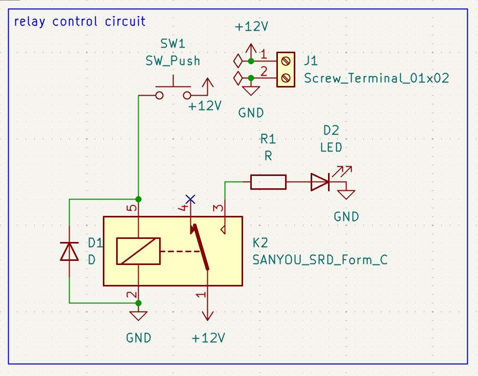
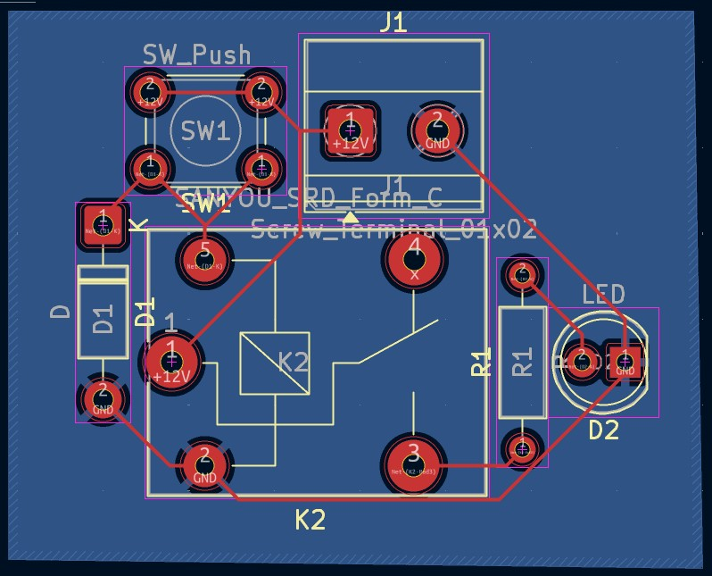

# RELAY CONTROL CIRCUIT

## Purpose

I designed this circuit to learn how we can easily switch high-voltage/high-power loads using low-voltage signals with the help of a relay.

## Learning Outcomes
- ✅ Performing switching operations without any physical/manual intervention
- ✅ Triggering high-voltage operations using a low-voltage signal
- ✅ Understanding why a **Flyback diode** must be used and where to position it in a circuit

## Technical Details

### Circuit Design

- Components list

    - 1 Relay
    - 1 Diode
    - 1 Resistor
    - 1 01x02 Screw Terminal
    - 1 Push Button

### Simulation/Testing

- Images/graphs

## Design Decisions

The R1 resistor was added to prevent a short circuit on the relay's pin 3, the Push Button was included to perform the simulation, and the Screw Terminal was used to apply voltage to the circuit. The D1 diode acts as a **Flyback diode**; it was added to safely route the **excess back-EMF current to the ground** when the relay switches from pin 4 to pin 3, protecting the circuit.

## Future Improvements

- In microcontroller-driven environments, utilizing a transistor to drive the relay coil is more practical due to both size and switching speed advantages.