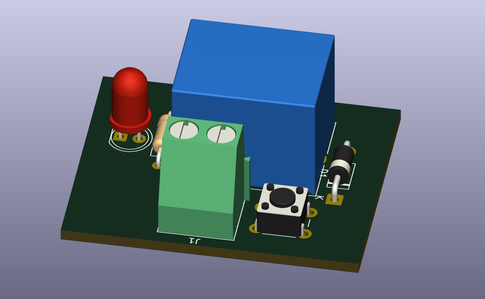

# RELAY CONTROL CIRCUIT

## Purpose

Bu devreyi küçük voltage ile büyük voltaj gerektiren durumları röle ile nasıl kolayca gerçekleştirebileceğimizi öğrenmek için tasarladım.

## Learning Outcomes
- ✅ Fiziksel bir müdahale olmadan anahtarlama yapmak
- ✅ Yüksek voltaj gerektiren işlemleri küçük voltaj ile tetikleyebilmek
- ✅ **FlyBack diyotunu** neden kullanmamız gerektiği ve devrede nereye konulacağı

## Technical Details

### Circuit Design

- Components list

    - 1 RELAY
    - 1 DIOD
    - 1 RESISTOR
    - 1 01x02 SCREW TERMINAL
    - 1 PUSH BUTTON

### Simulation/Testing

- Images/graphs

## Design Decisions

R1 direnci rölenin 3 nolu hattında kısa devre olmaması için, SW Push simülasyonu gerçekleştirmek için, Screw Terminal voltaj vermemiz için, D1 diyotu ise **Fly-Back** işlevi görmesi için yani röle 4 nolu hattan 3 nolu hata tetiklendiğinde üzerindeki **fazla akımı toprağa boşaltması için** eklenmiştir.

## Future Improvements

- Mikrodenetleyici gibi ortamlarda transistör kullanılması daha mantıklıdır, hem boyut hem de hız avantajından dolayı